<div align="center">

# AI SMART COOKING ASSISTANT

### A multi-modal, nutrition-aware recipe recommendation system

*Ingredients in (text, voice or photo). Personalized, measurable, low-waste meals out.*


[Recruiter Summary](#recruiter-summary-30-second-read) | [Research vs Engineering](#2-the-cognitive-split-academic-rigor-vs-enterprise-utility) | [System and Assets](#3-system-interaction-and-asset-showcase) | [Contribution](#4-team-collaboration-and-delivery) | [Validation](#5-quantified-validation-metrics) | [Citation and Reproducibility](#6-citation-and-reproducibility)

</div>

---

> [!NOTE]
> **Documentation hub only.** The source code lives in a private repository. This repository documents the problem, research framing, architecture, proof of a working system, test results, and my individual ownership within a team project. Source access can be discussed on request.

## Recruiter Summary (30-second read)

| | |
|---|---|
| **What it is** | A full-stack web application that turns the ingredients a user already has (typed, spoken or photographed) into ranked, personalized recipes with nutrition data and ingredient substitutions |
| **Why it matters** | Reduces household food waste (UN SDG 12) and supports healthier eating (UN SDG 3) |
| **My role** | Core contributor across the full lifecycle (ideation, AI integration, backend, frontend, multi-modal input, authentication) and **sole owner of the Cloudinary cloud image-storage integration** |
| **Stack** | Node.js, Express.js, MongoDB Atlas, Cloudinary, JavaScript, HTML/CSS, machine learning (content-based filtering, NLP), Web Speech API |
| **Result** | 5 of 5 acceptance tests passed; 7 of 8 latency targets met; text-to-recipe in 4.3 s end to end against a 5 s target; one target missed and analysed (image path, 7.1 s) |
| **Skills shown** | REST API design, ML model integration, cloud services, NoSQL data modelling, multi-modal input handling, test design, technical documentation, team delivery |

| 3 | 10 | 8 | 5 | 11 |
|:---:|:---:|:---:|:---:|:---:|
| input modalities | functional requirements | latency test cases | acceptance tests | diagrams and screenshots |

---

## 1. Global Project Overview

**Problem.** Households decide what to cook by searching recipe sites, then discover they lack ingredients. The result is slow planning, extra purchases and avoidable food waste. A comparative review of 17 existing recipe tools and apps found that most accept only one input mode, lock AI features behind paywalls, give generic or missing nutrition data, and some do not encrypt or allow deletion of user data.

**Solution.** The Smart Cooking Assistant inverts the workflow: the user starts with the ingredients they already own, entered by **text, voice or photo**, and the system returns ranked, personalized recipes with instructions, ingredient substitutions and macro-level nutrition.

**Who it serves.** Students, working professionals, families and health-conscious users who want a fast, low-waste answer to "what can I cook with what I have?"

| Dimension | Summary |
|---|---|
| Project scale | Full-stack web application, ML recommendation engine, 3 input modalities, user accounts, cloud media storage, 10 functional requirements, 8 performance test cases, 5 functional acceptance tests |
| Team | 3-person collaborative project |
| Sustainability angle | Reduces household food waste (UN SDG 12) and supports healthier eating (UN SDG 3) |
| Evidence in this repo | 7 architecture and design diagrams, 4 operational screenshots, measured latency results, documented limitations |

---

## 2. The Cognitive Split: Academic Rigor vs. Enterprise Utility

<table>
<tr>
<th width="50%">RESEARCH DIMENSION</th>
<th width="50%">ENGINEERING DIMENSION</th>
</tr>
<tr>
<td valign="top">

<b>Research gap</b>
<br>Systematic comparison of 17 existing tools identified 8 recurring gaps: single-mode input, no recipe persistence, paywalled AI features, data-privacy risks, narrow cuisine coverage, weak nutrition data, heavy device requirements, and cluttered interfaces.
<br><br>
<b>Working hypothesis</b>
<br>A recommender that combines content-based filtering and NLP-parsed ingredient input across three modalities can return relevant, preference-aware recipes within an interactive latency budget (about 5 seconds end to end) on commodity hardware.
<br><br>
<b>Research questions</b>
<ul>
<li><b>RQ1.</b> Can text, voice and image input share one recommendation pipeline within a 3 to 6 second budget?</li>
<li><b>RQ2.</b> Which pipeline stage dominates response time?</li>
<li><b>RQ3.</b> Can personalization constraints (diet, allergy, cuisine, skill, time) be applied without breaking that budget?</li>
</ul>
<b>Method</b>
<br>Content-based filtering over ingredient sets, NLP for free-text and voice-transcribed input, preference constraints, and match scoring per recipe. Model prototyping and training were done in Jupyter with Pandas and NumPy; the trained model is fixed at runtime.
<br><br>
<b>Contribution type</b>
<br>Integration and evaluation rather than a new algorithm: one unified pipeline that puts three input modalities, personalization and nutrition awareness behind a single recommendation API, evaluated stage by stage.
<br><br>
<b>Data governance</b>
<ul>
<li>Training and test data from publicly available, authorized sources, with licensing conditions respected</li>
<li>No sensitive personal data collected; interactions used only for recommendations</li>
<li>Nutrition values labelled informational and dataset-derived, not clinical</li>
<li>Requirement: passwords encrypted before storage; database access restricted to authorized modules</li>
</ul>
</td>
<td valign="top">

<b>Architecture decisions</b>
<ul>
<li>Modular pipeline: input processing, recommendation engine, recipe management, nutrition analysis and media storage as separate concerns</li>
<li>Node.js and Express.js API layer between the browser and the ML model, so the model can be swapped or retrained without touching the UI</li>
<li>MongoDB Atlas document model for recipes, users, preferences, goals and favorites</li>
<li>Cloudinary for cloud image storage, keeping binary uploads out of the application database</li>
<li>Browser-native Web Speech API for voice capture</li>
</ul>
<b>Edge cases handled</b>
<ul>
<li>Invalid, empty or incomplete ingredient input returns guidance instead of an error</li>
<li>Unsupported or corrupted image files rejected with a clear notification</li>
<li>Speech not recognized: user is prompted to retry</li>
<li>Recipe data unavailable: warning shown, application does not crash</li>
<li>Interrupted connectivity handled and communicated to the user</li>
<li>File-upload validation for format and size</li>
</ul>
<b>Scalability posture</b>
<ul>
<li>Latency measured per pipeline stage (frontend to backend, model call, database fetch, end to end) to locate bottlenecks</li>
<li>Designed goals: growing recipe database, more users, new cuisines added without redeploying the model, future cloud deployment</li>
<li>Tested configurations: Chrome, Edge and Firefox on Windows 10/11 and Android</li>
<li>Known scale limits documented openly (Section 5.3)</li>
</ul>
<b>Non-functional requirements traced into tests</b>
<br>Performance, usability, reliability, scalability, security, compatibility, maintainability and availability.
</td>
</tr>
</table>

### 2.1 Design decisions and trade-offs

| Decision | Why | Trade-off accepted |
|---|---|---|
| Keep the ML model separate from the API and fixed at runtime | Recommendation logic can be updated without touching the UI or backend routes | Improvements need an offline retraining and redeploy step |
| Content-based filtering | Works from the ingredient list alone, with no user-history cold-start problem | Quality depends on the size and diversity of the recipe dataset |
| Cloudinary for images | Keeps binary uploads out of the database and offloads media storage | Adds an external service dependency and needs an internet connection |
| Web Speech API for voice | No server-side audio pipeline to build or host | Works only on browsers that support the API |
| MongoDB document model | Recipes carry nested arrays (ingredients, steps) and a nutrition object | Fewer relational guarantees than SQL; validation lives in the application layer |

---

## 3. System Interaction and Asset Showcase

### 3.1 System context and data flow

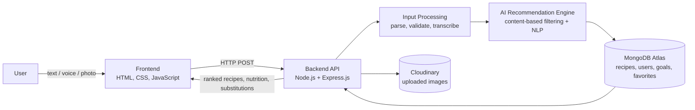

<p align="center">
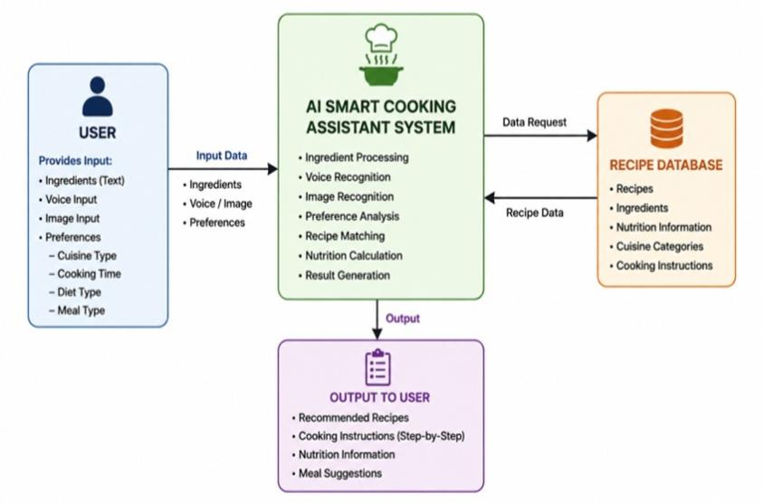<br>
<sub><b>Figure 1. System overview.</b> User-supplied ingredients and preferences enter the assistant; the recommendation core consults the recipe database and returns instructions, nutrition data and meal suggestions.</sub>
</p>

<p align="center">
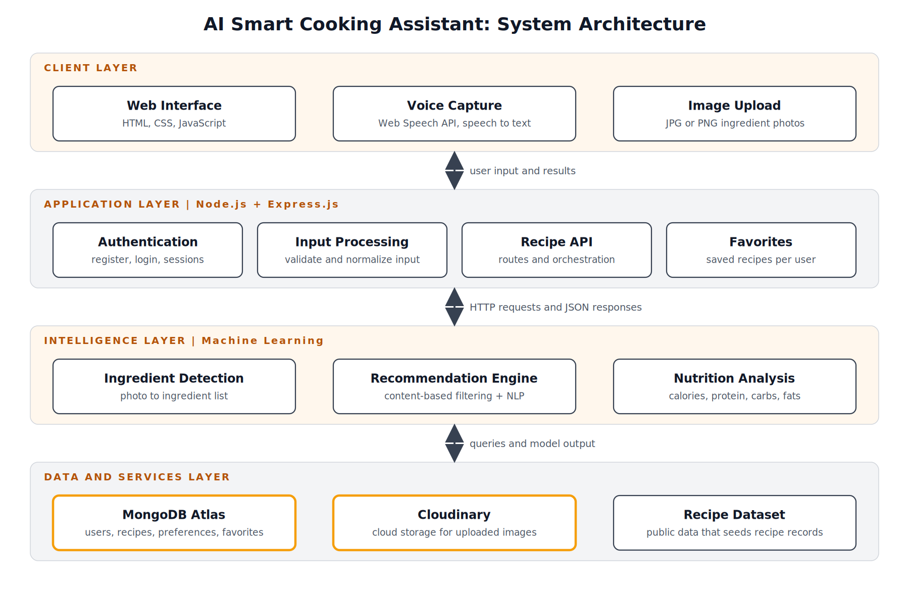<br>
<sub><b>Figure 2. Layered architecture.</b> Client layer (web interface, voice capture, image upload), application layer (authentication, input processing, recipe API, favorites on Node.js and Express), intelligence layer (ingredient detection, recommendation engine, nutrition analysis) and a data and services layer (MongoDB Atlas, Cloudinary, public recipe dataset).</sub>
</p>

### 3.2 Design artifacts

<p align="center">
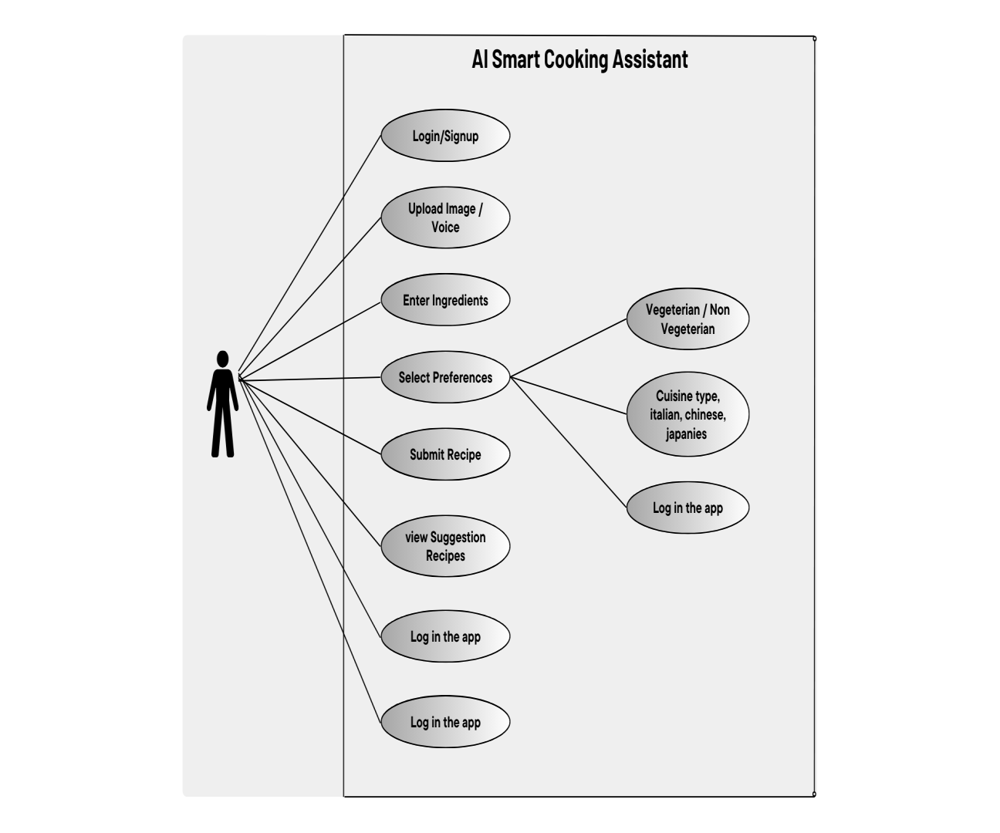<br>
<sub><b>Figure 3. Use case model.</b> Actor-level view of registration, login, ingredient entry, preference selection, recipe generation, favorites and nutrition goals.</sub>
</p>

<p align="center">
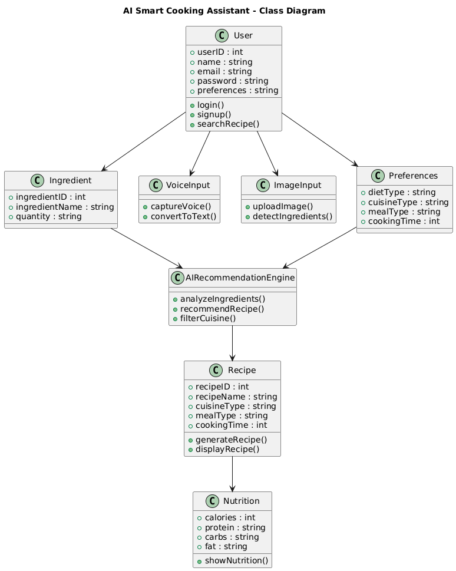<br>
<sub><b>Figure 4. Class model.</b> Core domain entities (user, recipe, ingredient, preferences, nutrition) and the recommendation engine that relates them.</sub>
</p>

<p align="center">
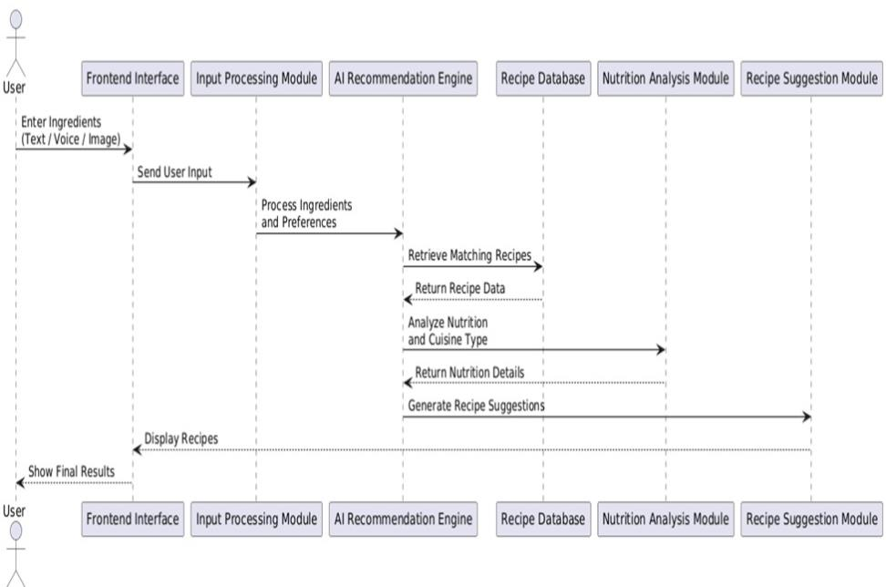<br>
<sub><b>Figure 5. Recommendation sequence.</b> Message flow from user input through processing, matching, nutrition analysis and suggestion generation back to the interface. This is the path timed in Section 5.1.</sub>
</p>

<table align="center">
<tr>
<td align="center" valign="top" width="50%">
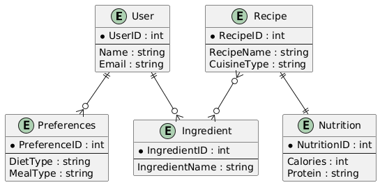<br>
<sub><b>Figure 6. Data model (ER).</b> Users, recipes, ingredients, preferences and nutrition records.</sub>
</td>
<td align="center" valign="top" width="50%">
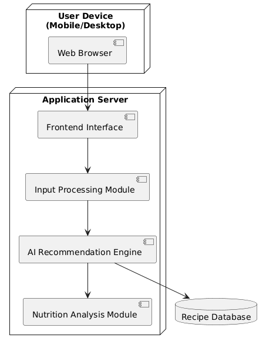<br>
<sub><b>Figure 7. Deployment view.</b> Browser client, application server modules and database tier.</sub>
</td>
</tr>
</table>

### 3.3 Operational proof (running system)

<p align="center">
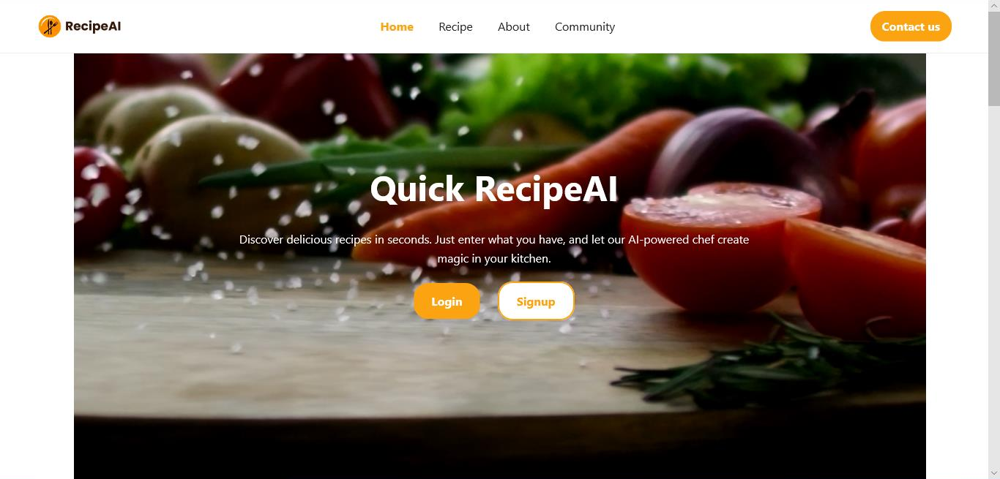<br>
<sub><b>Figure 8. Landing experience.</b> Entry point with authentication and navigation.</sub>
</p>

<p align="center">
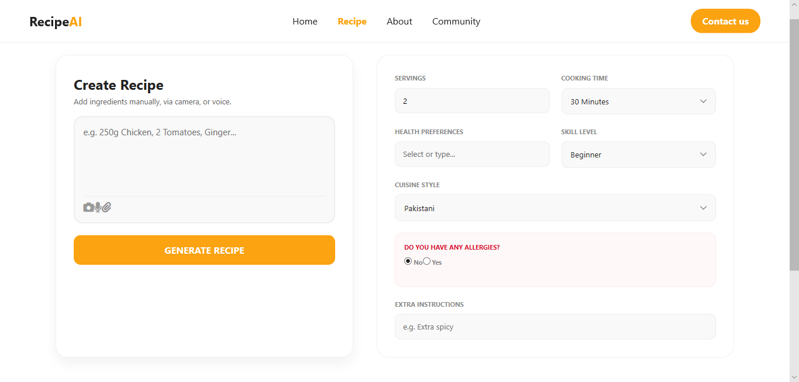<br>
<sub><b>Figure 9. Multi-modal input and constraint panel.</b> Free-text ingredient entry with camera and voice controls, plus servings, cooking time, health preference, skill level, cuisine and allergy filters.</sub>
</p>

<p align="center">
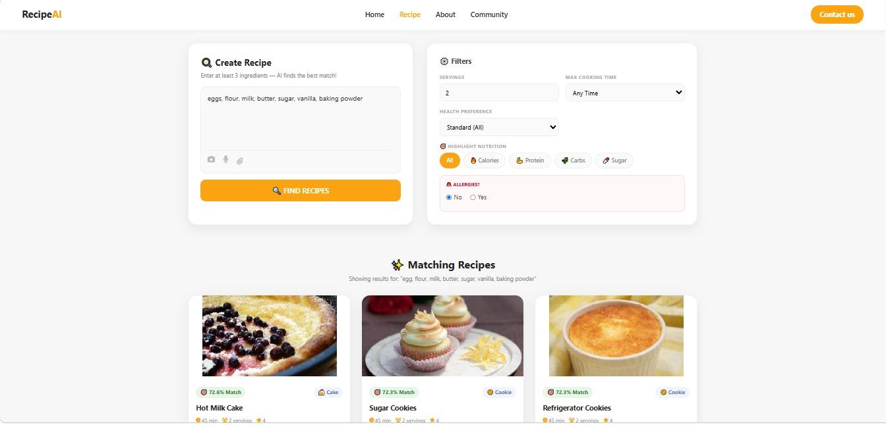<br>
<sub><b>Figure 10. Ranked recommendations.</b> Results with per-recipe match percentage and macro highlights (calories, protein, carbohydrates, sugar).</sub>
</p>

<p align="center">
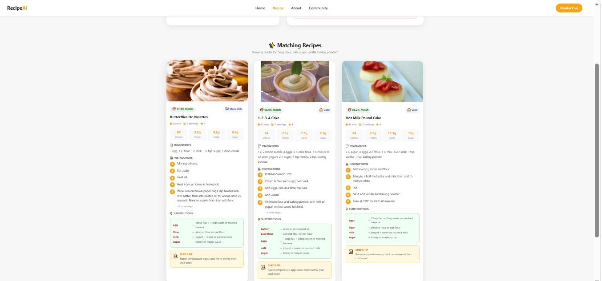<br>
<sub><b>Figure 11. Recipe detail cards.</b> Ingredient lists, step-by-step instructions, nutrition breakdown and substitution suggestions for missing ingredients.</sub>
</p>

<!--
OPTIONAL: add proof of the parts you built yourself, then delete this comment. Hide keys, emails and connection strings first.

<p align="center">
<br>
<sub><b>Figure 12. Cloud media storage.</b> Uploaded ingredient images stored and served through Cloudinary.</sub>
</p>

<p align="center">
<br>
<sub><b>Figure 13. Data layer.</b> Recipe, user and preference collections in MongoDB Atlas.</sub>
</p>
-->

---

## 4. Team Collaboration and Delivery

This was a fully collaborative project. The three of us worked as one team across every stage, from the first idea to the tested system, sharing the work, the decisions and the integration.

### 4.1 How We Built It Together

| Stage | What we did together | Stack and tools | Proof in this repo |
|---|---|---|---|
| Ideation and research | Framed the problem, reviewed existing recipe tools, agreed the scope and the gap to target | Gap analysis, literature review | Sections 1 and 2 |
| Requirements and design | Defined functional requirements FR-01 to FR-10 and the quality requirements, and modelled the system in UML | UML, requirements analysis | Figures 3 to 7 |
| AI integration | Connected the trained ML model to the API: ingredient parsing, preference-aware ranking and match scoring | Node.js, trained ML model, NLP | Figures 5 and 10; TC-P05 1.6 s against a 2 s target |
| Backend | Built the recommendation endpoint, request validation, error handling and database integration | Node.js, Express.js, MongoDB Atlas | TC-P06 0.7 s against 1 s; TC-P07 4.3 s end to end against 5 s |
| Frontend | Built the ingredient form, preference panel, results views and recipe-detail cards | HTML, CSS, JavaScript | Figures 8 to 11 |
| Multi-modal input and cloud media | Implemented text, voice and image input, with uploaded photos stored through Cloudinary | JavaScript, Web Speech API, Cloudinary | Figure 9; TC-03 and TC-04 passed; TC-P03 3.4 s, TC-P04 5.2 s |
| Authentication and user data | Built registration, login, favorites and nutrition-goal persistence | Node.js, Express.js, MongoDB | FR-01, FR-02, FR-07, FR-08, FR-10; TC-01 and TC-05 passed |
| Testing and evaluation | Designed and ran performance, acceptance and installation tests, then analysed the image-pipeline miss | Test design, stage-wise latency protocol | Section 5 |
| Documentation | Produced the architecture views, test documentation and this repository | UML, technical writing | Figures 1 to 7 |

**How we worked**

- Planned the delivery with a Gantt chart and a work breakdown structure across six phases: planning, design, development, testing, deployment and documentation
- Kept the frontend, backend and AI model as independent modules, so each part could be built, tested and integrated without blocking the others
- Used Git and GitHub for shared version control
- Measured latency stage by stage as a team, so a failed target (the image path) could be traced to its cause instead of guessed at

**Outcome:** 5 of 5 acceptance tests passed and 7 of 8 latency targets met (Section 5).
### 4.2 Skills demonstrated

| Skill area | Evidence |
|---|---|
| Backend engineering | REST-style Express.js API, validation, error handling, database integration |
| AI and ML integration | Trained model wired into a production-style API with parsing, ranking and match scoring |
| Cloud services | Cloudinary media storage; MongoDB Atlas data layer |
| Frontend development | Multi-step input UI with preference filters and detail views |
| Data modelling | Document schema for recipes, users, preferences, goals and favorites (Figure 6) |
| Testing and quality | Stage-wise latency protocol, acceptance cases, exception-handling scenarios |
| Research method | Gap analysis of 17 tools, working hypothesis, research questions, threats to validity |
| Collaboration | Shared ownership of a 3-person delivery, with one module owned individually |

---

## 5. Quantified Validation Metrics

### 5.1 Performance targets vs. achieved

| Test ID | Scenario | Target | Achieved | Headroom | Result |
|---|---|---|---|---|---|
| TC-P01 | Text input, single ingredient | < 3.0 s | 2.1 s | +30% | Met |
| TC-P02 | Text input, multiple ingredients | < 4.0 s | 3.8 s | +5% | Met |
| TC-P03 | Voice input processing | < 4.0 s | 3.4 s | +15% | Met |
| TC-P04 | Image upload and ingredient detection | < 6.0 s | 5.2 s | +13% | Met |
| TC-P05 | AI model prediction call | < 2.0 s | 1.6 s | +20% | Met |
| TC-P06 | MongoDB recipe fetch | < 1.0 s | 0.7 s | +30% | Met |
| TC-P07 | End to end, text plus preferences | < 5.0 s | 4.3 s | +14% | Met |
| TC-P08 | End to end, image plus preferences | < 5.0 s | 7.1 s | -42% | **Not met** |

**Summary:** 7 of 8 latency targets met.

**What the numbers say (answers to the research questions)**

- **RQ1.** Text and voice fit their budgets. Image input meets its own stage target (5.2 s against 6 s) but not the full end-to-end budget (7.1 s against 5 s), so the shared pipeline works for two modalities and needs optimization for the third.
- **RQ2.** The model call (1.6 s) and database fetch (0.7 s) are small. The image stage alone measured 5.2 s, roughly three quarters of the 7.1 s end-to-end time, so **image processing is the primary bottleneck**.
- **RQ3.** Text input with the full preference set completed in 4.3 s against a 5 s target, so personalization constraints fit inside the budget.

### 5.2 Functional acceptance

| Test ID | Module | Scenario | Result |
|---|---|---|---|
| TC-01 | Authentication | Valid login redirects to home | Pass |
| TC-02 | Recommendation | Recipe generation from text | Pass |
| TC-03 | Voice recognition | Recipe generation from speech | Pass |
| TC-04 | Image processing | Recipe generation from uploaded photo | Pass |
| TC-05 | Favorites | Save recipe to favorites | Pass |

**5 of 5 acceptance tests passed.** A six-step installation procedure (install, first launch, all input methods, recommendation, settings persistence, uninstall) also passed.

### 5.3 Evaluation scope and threats to validity

- **Environment:** Latency figures come from a local development setup (Intel Core i5, 8 GB RAM, Windows 10, localhost Node.js server, 50 Mbps broadband) and are not production benchmarks.
- **Not measured:** Recommendation precision and recall against a labelled ground-truth set were not evaluated. Relevance was assessed through functional and usability testing.
- **Load:** Load scenarios (repeated requests, large datasets, concurrent users, batch image upload) were defined, but throughput figures were not reported.
- **Dataset dependence:** Recommendation quality and nutrition values depend on the size and diversity of the recipe dataset; nutrition values are estimates.
- **Modality gap:** Image detection degrades on blurry or poorly lit photos.

---

## 6. Citation and Reproducibility

### 6.1 Cite this work

```bibtex
@misc{smart_cooking_assistant_2026,
  author       = {{AI Smart Cooking Assistant Project Team}},
  title        = {AI Smart Cooking Assistant: A Multi-Modal, Nutrition-Aware Recipe Recommendation System},
  year         = {2026},
  howpublished = {\url{https://github.com/Mominaaah/REPO-NAME}},
  note         = {Documentation repository. Source code maintained in a private repository.}
}
```

### 6.2 Reproduction roadmap

Independent researchers can validate the documented architecture without the private source:

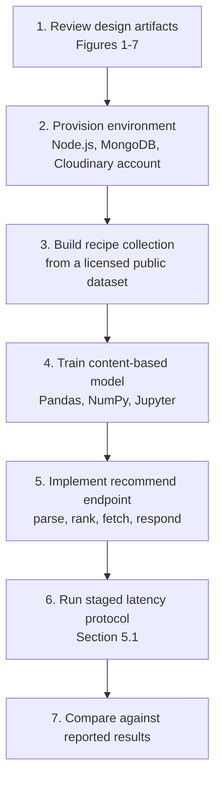

| Step | What to do | Reference |
|---|---|---|
| 1 | Study use case, class, sequence, ER and deployment models | Figures 3 to 7 |
| 2 | Set up Node.js and Express.js, a MongoDB instance and a Cloudinary account | Section 2 |
| 3 | Create a `recipes` collection with: recipe ID, name, ingredients (array), instructions (array), cuisine type, meal type, diet type, cooking time, nutrition (object). Add `users` (ID, name, email, hashed password) and `preferences` (cuisine, diet, meal type, cooking time) | Figure 6 |
| 4 | Vectorize ingredient sets and train or configure a content-based similarity model; add NLP parsing for free-text and transcribed voice input | Section 2 |
| 5 | Expose a recommend endpoint that accepts ingredients and preferences and returns ranked recipes with match score, nutrition and substitutions | Figures 2 and 5 |
| 6 | Measure four stages separately: frontend to backend, backend and model call, database retrieval, total end to end. Use the same input scenarios as TC-P01 to TC-P08 | Section 5.1 |
| 7 | Report deviations and the environment used. Extend with precision and recall against a labelled set, which this project did not cover | Section 5.3 |

### 6.3 Where to verify each claim

| Claim | Evidence |
|---|---|
| Three input modalities | Figure 9; TC-02, TC-03, TC-04 |
| Personalized, nutrition-aware results | Figures 10 and 11 |
| Latency results | Section 5.1 |
| Data model | Figure 6 |
| Working system | Figures 8 to 11 |

### 6.4 Intellectual property

Documentation is shared for portfolio and educational purposes. Copyright remains with the project team. Please do not reuse text, diagrams or screenshots without permission.

### 6.5 Roadmap

- Labelled evaluation set for precision, recall and ranking quality
- Faster image pipeline to meet the 5 s end-to-end target
- Larger, regionally diverse recipe dataset and multilingual support (including Urdu)
- Shopping-list generation and deeper nutrition analysis
- Feedback loops so recommendations improve with use
- Load testing beyond local hardware

---

<div align="center">

**Contact:** [LinkedIn](https://linkedin.com/in/mominaramzan) | [GitHub](https://github.com/Mominaaah)

</div>
