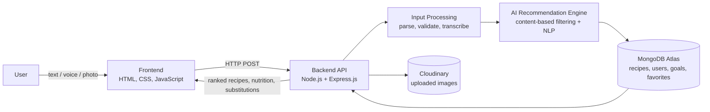
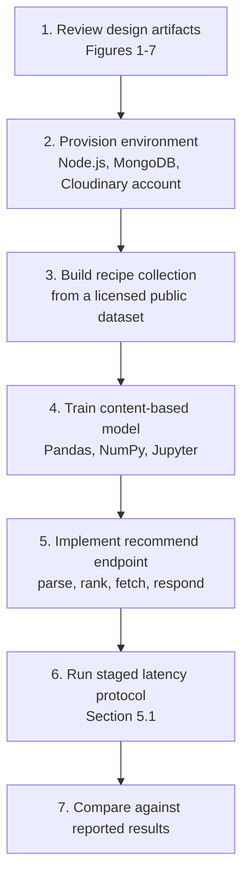

<div align="center">

# AI SMART COOKING ASSISTANT

### A multi-modal, nutrition-aware recipe recommendation system

*Ingredients in (text, voice or photo). Personalized, measurable, low-waste meals out.*


[Research vs Engineering](#2-the-cognitive-split-academic-rigor-vs-enterprise-utility) | [System and Assets](#3-system-interaction-and-asset-showcase) | [My Contribution](#4-individual-contribution-matrix) | [Validation](#5-quantified-validation-metrics) | [Citation and Reproducibility](#6-citation-and-reproducibility)

</div>

---

> [!NOTE]
> **Documentation hub only.** The source code lives in a private repository. This repository documents the problem, research framing, architecture, evidence of a working system, test results, and my individual ownership within a team project. Source access can be discussed on request.

## 1. Global Project Overview

**Problem.** Households decide what to cook by searching recipe sites, then discover they lack ingredients. The result is slow planning, extra purchases and avoidable food waste. A comparative review of 17 existing recipe tools and apps found that most accept only one input mode, lock AI features behind paywalls, give generic or missing nutrition data, and some do not encrypt or allow deletion of user data.

**Solution.** The Smart Cooking Assistant inverts the workflow: the user starts with the ingredients they already own, entered by **text, voice or photo**, and the system returns ranked, personalized recipes with instructions, ingredient substitutions and macro-level nutrition.

| Dimension | Summary |
|---|---|
| Project scale | Full-stack web application, ML recommendation engine, 3 input modalities, user accounts, cloud media storage, 10 functional requirements, 8 performance test cases, 5 functional acceptance tests |
| Team | 3-person collaborative project |
| My ownership | Idea generation, AI integration, backend, frontend, Cloudinary media storage (details in [Section 4](#4-individual-contribution-matrix)) |
| Sustainability angle | Reduces household food waste (UN SDG 12) and supports healthier eating (UN SDG 3) |
| Evidence in this repo | 7 architecture and design diagrams, 4 operational screenshots, measured latency results, documented limitations |

---

## 2. The Cognitive Split: Academic Rigor vs. Enterprise Utility

<table>
<tr>
<th width="50%">RESEARCH DIMENSION</th>
<th width="50%">ENGINEERING DIMENSION</th>
</tr>
<tr>
<td valign="top">

<b>Research gap</b>
<br>Systematic comparison of 17 existing tools identified 8 recurring gaps: single-mode input, no recipe persistence, paywalled AI features, data-privacy risks, narrow cuisine coverage, weak nutrition data, heavy device requirements, and cluttered interfaces.
<br><br>
<b>Working hypothesis</b>
<br>A recommender that combines content-based filtering and NLP-parsed ingredient input across three modalities can return relevant, preference-aware recipes within an interactive latency budget (about 5 seconds end to end) on commodity hardware.
<br><br>
<b>Method</b>
<br>Content-based filtering over ingredient sets, NLP for free-text and voice-transcribed input, preference constraints (cuisine, diet, meal type, cooking time, skill, allergies), and match scoring per recipe. Model prototyping and training were done in Jupyter with Pandas and NumPy.
<br><br>
<b>Contribution type</b>
<br>Integration and evaluation rather than a new algorithm: a unified pipeline that puts three input modalities, personalization and nutrition awareness behind one recommendation API, evaluated stage by stage.
<br><br>
<b>Data governance</b>
<ul>
<li>Training and test data from publicly available, authorized sources, with licensing conditions respected</li>
<li>No sensitive personal data collected; interactions used only for recommendations</li>
<li>Nutrition values labelled informational and dataset-derived, not clinical</li>
<li>Passwords encrypted before storage; database access restricted to authorized modules</li>
</ul>
</td>
<td valign="top">

<b>Architecture decisions</b>
<ul>
<li>Modular pipeline: input processing, recommendation engine, recipe management, nutrition analysis and media storage as separate concerns</li>
<li>Node.js and Express.js API layer between the browser and the ML model, so the model can be swapped or retrained without touching the UI</li>
<li>MongoDB Atlas document model for recipes, users, preferences, goals and favorites</li>
<li>Cloudinary for cloud image storage, keeping binary uploads out of the application database</li>
<li>Browser-native Web Speech API for voice capture</li>
</ul>
<b>Edge cases handled</b>
<ul>
<li>Invalid, empty or incomplete ingredient input returns guidance instead of an error</li>
<li>Unsupported or corrupted image files rejected with a clear notification</li>
<li>Speech not recognized: user is prompted to retry</li>
<li>Recipe data unavailable: warning shown, application does not crash</li>
<li>Interrupted connectivity handled and communicated to the user</li>
<li>File-upload validation for format and size</li>
</ul>
<b>Scalability posture</b>
<ul>
<li>Latency measured per pipeline stage (frontend to backend, model call, database fetch, end to end) to locate bottlenecks</li>
<li>Cross-browser (Chrome, Edge, Firefox) and cross-OS (Windows 10/11, Android) compatibility tested</li>
<li>Known scale limits documented honestly (see Section 5)</li>
</ul>
</td>
</tr>
</table>

---

## 3. System Interaction and Asset Showcase

### 3.1 System context and data flow



<p align="center">
<br>
<sub><b>Figure 1. System overview.</b> User-supplied ingredients and preferences enter the assistant; the recommendation core consults the recipe database and returns instructions, nutrition data and meal suggestions.</sub>
</p>

<p align="center">
<br>
<sub><b>Figure 2. Implementation architecture.</b> Frontend interface, input-processing module and AI recommendation engine feed the database, nutrition-analysis and recipe-suggestion modules, with results returned along the same path.</sub>
</p>

### 3.2 Design artifacts

<p align="center">
<br>
<sub><b>Figure 3. Use case model.</b> Actor-level view of registration, login, ingredient entry, preference selection, recipe generation, favorites and nutrition goals.</sub>
</p>

<p align="center">
<br>
<sub><b>Figure 4. Class model.</b> Core domain entities (user, recipe, ingredient, preferences, nutrition) and the recommendation engine that relates them.</sub>
</p>

<p align="center">
<br>
<sub><b>Figure 5. Recommendation sequence.</b> Message flow from user input through processing, matching, nutrition analysis and suggestion generation back to the interface.</sub>
</p>

<table align="center">
<tr>
<td align="center" valign="top" width="50%">
<br>
<sub><b>Figure 6. Data model (ER).</b> Users, recipes, ingredients, preferences and nutrition records.</sub>
</td>
<td align="center" valign="top" width="50%">
<br>
<sub><b>Figure 7. Deployment view.</b> Browser client, application server modules and database tier.</sub>
</td>
</tr>
</table>

### 3.3 Operational proof (running system)

<p align="center">
<br>
<sub><b>Figure 8. Landing experience.</b> Entry point with authentication and navigation.</sub>
</p>

<p align="center">
<br>
<sub><b>Figure 9. Multi-modal input and constraint panel.</b> Free-text ingredient entry with camera and voice controls, plus servings, cooking time, health preference, skill level, cuisine and allergy filters.</sub>
</p>

<p align="center">
<br>
<sub><b>Figure 10. Ranked recommendations.</b> Results with per-recipe match percentage and macro highlights (calories, protein, carbohydrates, sugar).</sub>
</p>

<p align="center">
<br>
<sub><b>Figure 11. Recipe detail cards.</b> Ingredient lists, step-by-step instructions, nutrition breakdown and substitution suggestions for missing ingredients.</sub>
</p>

---

## 4. Individual Contribution Matrix

The project was delivered by a 3-person team. **Momina Ramzan** collaborated across the full lifecycle, from ideation to build, and owned the cloud media-storage integration.

| Feature / Module | Assigned Lead | Engineering Tasks Involved |
|---|---|---|
| Ideation and requirements | Shared: **Momina (core contributor)** and team | Problem framing, competitor review, feature scoping, functional requirement definition |
| AI integration (recommendation engine) | Shared: **Momina (core contributor)** and team | Connecting the trained ML model to the API, ingredient parsing, preference-aware ranking, match scoring |
| Backend API | Shared: **Momina (core contributor)** and team | Node.js and Express.js services, recommendation endpoint, request validation, error handling, MongoDB integration |
| Authentication and user data | Shared: **Momina (core contributor)** and team | Registration and login flows, credential handling, favorites and nutrition-goal persistence |
| Frontend interface | Shared: **Momina (core contributor)** and team | HTML, CSS and JavaScript UI, input forms, preference panel, results and recipe detail views, responsive layout |
| Multi-modal input handling | Shared: **Momina (core contributor)** and team | Text entry, voice capture via Web Speech API, image upload flow, input validation |
| Cloud image storage | **Momina (owner)** | Cloudinary integration for storing uploaded images through the backend |
| Testing and evaluation | Team | Performance test cases, functional acceptance tests, compatibility and exception-handling checks |
| Documentation and design modelling | Team | UML artifacts, architecture views, test documentation |

<!-- EDITING NOTE: change "Shared" to "Momina (lead)" only for modules you personally led. Keep every row true. -->

---

## 5. Quantified Validation Metrics

### 5.1 Performance targets vs. achieved

| Test ID | Scenario | Target | Achieved | Headroom | Result |
|---|---|---|---|---|---|
| TC-P01 | Text input, single ingredient | < 3.0 s | 2.1 s | +30% | Met |
| TC-P02 | Text input, multiple ingredients | < 4.0 s | 3.8 s | +5% | Met |
| TC-P03 | Voice input processing | < 4.0 s | 3.4 s | +15% | Met |
| TC-P04 | Image upload and ingredient detection | < 6.0 s | 5.2 s | +13% | Met |
| TC-P05 | AI model prediction call | < 2.0 s | 1.6 s | +20% | Met |
| TC-P06 | MongoDB recipe fetch | < 1.0 s | 0.7 s | +30% | Met |
| TC-P07 | End to end, text plus preferences | < 5.0 s | 4.3 s | +14% | Met |
| TC-P08 | End to end, image plus preferences | < 5.0 s | 7.1 s | -42% | **Not met** |

**Summary:** 7 of 8 latency targets met. The one miss (image pipeline) isolates image processing as the primary optimization target.

### 5.2 Functional acceptance

| Test ID | Module | Scenario | Result |
|---|---|---|---|
| TC-01 | Authentication | Valid login redirects to home | Pass |
| TC-02 | Recommendation | Recipe generation from text | Pass |
| TC-03 | Voice recognition | Recipe generation from speech | Pass |
| TC-04 | Image processing | Recipe generation from uploaded photo | Pass |
| TC-05 | Favorites | Save recipe to favorites | Pass |

**5 of 5 acceptance tests passed.** Compatibility was verified on Chrome, Edge and Firefox, on Windows 10, Windows 11 and Android.

### 5.3 Evaluation scope and threats to validity

- **Environment:** Latency figures come from a local development setup (Intel Core i5, 8 GB RAM, Windows 10, localhost Node.js server, 50 Mbps broadband). They are not production benchmarks.
- **Not measured:** Recommendation precision and recall against a labelled ground-truth set were not evaluated. Relevance was assessed through functional and usability testing.
- **Dataset dependence:** Recommendation quality and nutrition values depend on the size and diversity of the recipe dataset; nutrition values are estimates.
- **Modality gap:** Image detection degrades on blurry or poorly lit photos.

---

## 6. Citation and Reproducibility

### 6.1 Cite this work

```bibtex
@misc{smart_cooking_assistant_2026,
  author       = {{AI Smart Cooking Assistant Project Team}},
  title        = {AI Smart Cooking Assistant: A Multi-Modal, Nutrition-Aware Recipe Recommendation System},
  year         = {2026},
  howpublished = {\url{https://github.com/Mominaaah/REPO-NAME}},
  note         = {Documentation repository. Source code maintained in a private repository.}
}
```

### 6.2 Reproduction roadmap
 
Independent researchers can validate the documented architecture without the private source:
 


| Step | What to do | Reference |
|---|---|---|
| 1 | Study use case, class, sequence, ER and deployment models | Figures 3 to 7 |
| 2 | Set up Node.js and Express.js, a MongoDB instance and a Cloudinary account | Section 2 |
| 3 | Create a `recipes` collection with: recipe ID, name, ingredients (array), instructions (array), cuisine type, meal type, diet type, cooking time, nutrition (object). Add `users` (ID, name, email, hashed password) and `preferences` (cuisine, diet, meal type, cooking time) | Figure 6 |
| 4 | Vectorize ingredient sets and train or configure a content-based similarity model; add NLP parsing for free-text and transcribed voice input | Section 2 |
| 5 | Expose a recommend endpoint that accepts ingredients and preferences and returns ranked recipes with match score, nutrition and substitutions | Figures 2 and 5 |
| 6 | Measure four stages separately: frontend to backend, backend and model call, database retrieval, total end to end. Use the same input scenarios as TC-P01 to TC-P08 | Section 5.1 |
| 7 | Report deviations and the environment used. Extend with precision and recall against a labelled set, which this project did not cover | Section 5.3 |

### 6.3 Intellectual property

Documentation is shared for portfolio and educational purposes. Copyright remains with the project team. Please do not reuse text, diagrams or screenshots without permission.

### 6.4 Roadmap

- Labelled evaluation set for precision, recall and ranking quality
- Faster image pipeline to meet the 5 s end-to-end target
- Larger, regionally diverse recipe dataset and multilingual support (including Urdu)
- Shopping-list generation and deeper nutrition analysis
- Feedback loops so recommendations improve with use
- Load testing beyond local hardware

---

<div align="center">

**Contact:** [LinkedIn](https://linkedin.com/in/mominaramzan) | [GitHub](https://github.com/Mominaaah)

</div>
